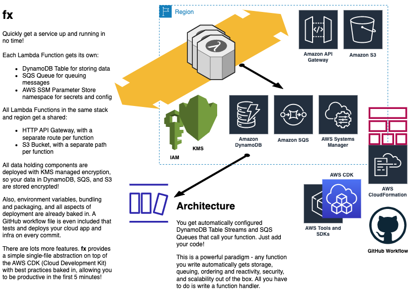

# fx

Instantly deploy functions to the cloud.

The fastest way to get a scalable service up and online.

> A powerful infrastructure abstraction built with the AWS CDK.

> "Wow, you are going to be *so* productive now."
> --not-so-anonymous user feedback

## Usage

Clone this project. It's yours now! 

The [cdk.ts](./src/lib/cdk.ts) file contains a convenient wrapper around the `aws-cdk`.

The [router.ts](./src/lib/router.ts) file contains a generic lambda handler that can handle any type of event.

You can run this to deploy:

```shell
npm install && npm run deploy
```

Just make sure you have AWS credentials locally as well as `node` and `npm`.

The following [examples](./src/examples/) will be deployed as part of a single CloudFormation stack:

- [hello.ts](./src/examples/hello.ts), a plain old AWS Lambda Function handler
- [multiple.ts](./src/examples/multiple.ts), a function that responds to api, queue, and table stream messages
- [express.ts](./src/examples/express.ts), a function that is configured as an express app
- [write.ts](./src/examples/write.ts), a function that writes to a DynamoDB table
- [eval.ts](./src/examples/eval.ts), a function that spawns a process to evaluate a javascript expression

## What does it do?

It contains some convenience functions that are used at deploy time to get
you some cloud goodness!

> Every referenced function will be deployed
> along with its associated cloud infrastructure
> (SQS Queue, DynamoDB Table).

> A single API Gateway HTTP API and S3 Bucket
> will be created. Each function gets its own
> route in the API and private path in the bucket.

- It deploys an API -> Lambda Function, so that you can respond to API requests.
- It deploys SQS -> Lambda Function, so you can react to queue events.
- It deploys DynamoDB -> Lambda Function, so you can react to table stream events.

All from the same function. A powerful paradigm and simple programming model.

All permissions are properly created and assigned as well. So:

- Only a single Lambda Function can access its own DynamoDB table.
- Multiple Lambda Functions can read from S3, but each function can only read from its own specific path in the bucket.

## How can I add more than one function?

In the `src/infrastructure.ts` file, just configure the paths to your lambda function entrypoints.

## Diagram



## Benchmarks

> Generates <2KB lambda functions with no runtime dependencies

- deploy no changes: 0m4.446s
- deploy with changes: 0m46.369s | 1m6.943s

## Support

That's all there is to it!

Open a GitHub issue to ask a question, report a bug, raise a concern, or request a new feature.

Also, your question may already be answered on the following [Hacker News thread](https://news.ycombinator.com/item?id=25236969).

Thanks for reading, and for making it all the way down here!
